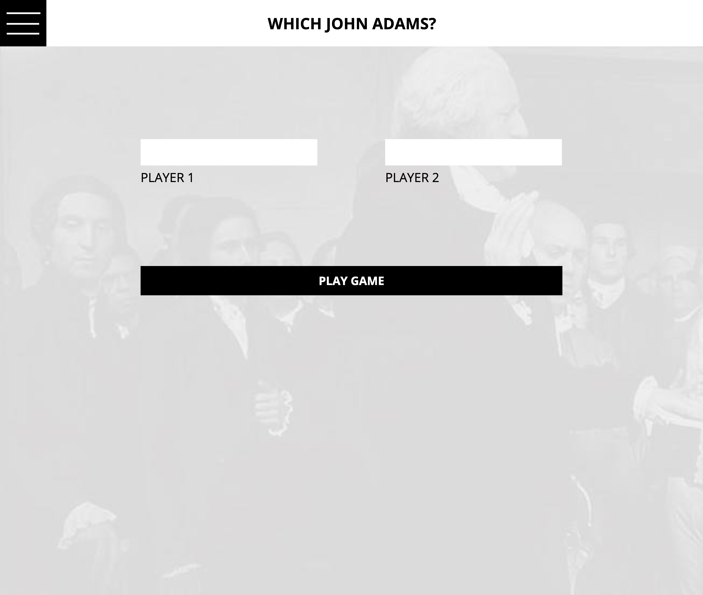
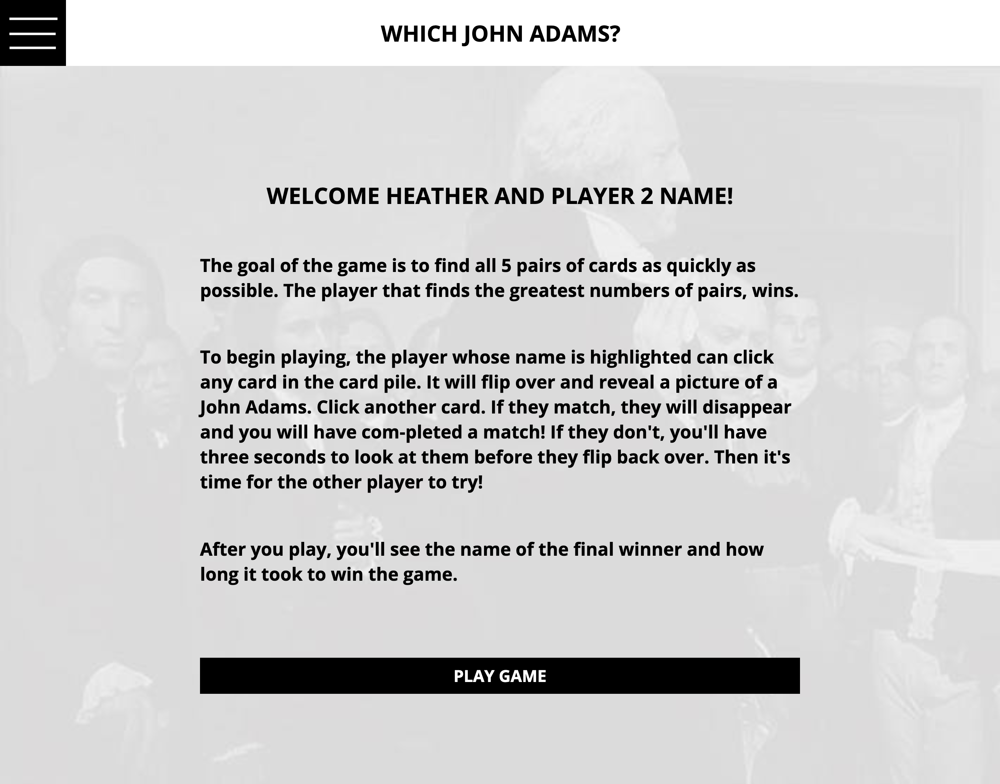
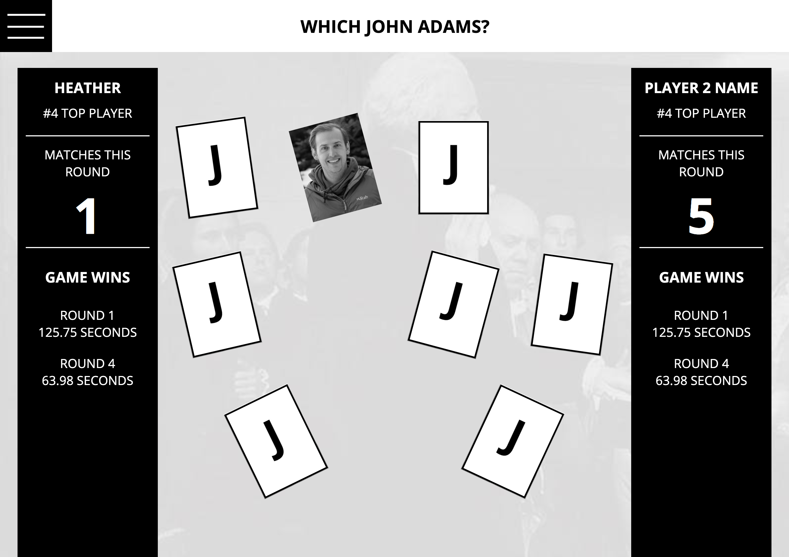
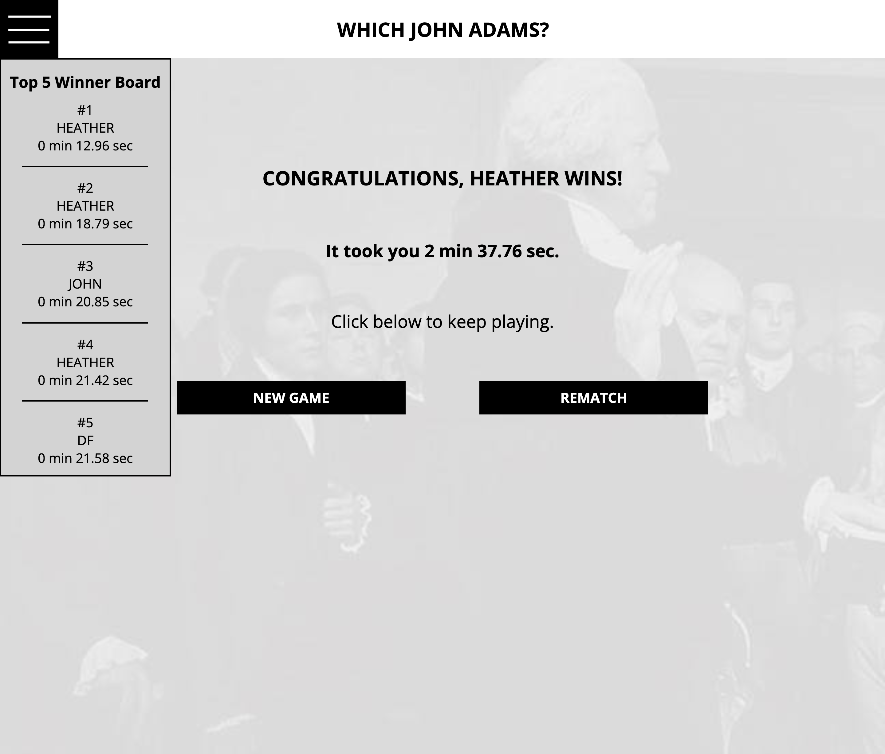

# Which John Adams?

## Overview of project
This Mod 1 Solo project required me to build an application for a matching game similar to the game memory, or concentration.   A data model was used to dynamically manipulate the DOM.   Cards begin face down and turned up to find a match by the user on click.  Matching cards will disappear and add a match to that user.  Un-matching cards will automatically flip back over after giving the user time to see them.

## Goals
* Utilize semantic HTML, DRY JavaScript, and DRY, clean CSS.
* Utilize localStorage to store and retrieve data that would persist on refresh
* Manipulate the DOM
* Understand both the data model and the DOM
* Utilize for loops and iteration technics on arrays of data
* Match and create a great UI/UX

## Technologies
CSS3, HTML5 and vanilla JavaScript were used for this project.

## My App Pictures

## Static Comp Pictures

